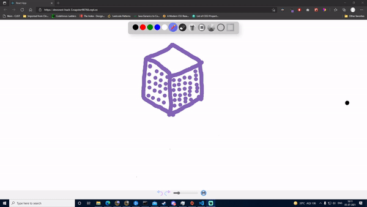

# _WhiteBoard_ 🖼️

This project was made by Team Aditya for [Devsnest](https://devsnest.in) Hackathon.

## About
Planning a new project? 
and wants to brainstorm can use this whiteboard.



## Live Demo 🏁

Checkout live demo [here](https://alt-deleted-whiteboard.netlify.app/).

## Features 📑
- Go digital😂! Jot down your thoughts and draw correlation.
- With this interactive whiteboard, you can save your work as a _.jpg_ file and take out a printout 🖨️
- With this, you can write and annotate.
- Made a mistake!!!(oh snap 😰), no worries you can undo with the _undo_ button
- Bad at making shapes? We got you! 

## Getting Started 📖

### - Pre-requisites
> `Node Js` - you can download it from [here](https://nodejs.org/en/).

### - Clone the project
>``` git clone  https://github.com/ALTDeleted/DEVSNEST-HACK-2.git ```

### - Run the project
> - Open directory where you have cloned the repo and type : 
`npm start` It runs the app in the development mode.
- Open [http://localhost:3000](http://localhost:3000) to view it in the browser.
The page will reload if you make edits.
- You will also see any lint errors in the console.
